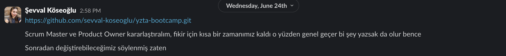
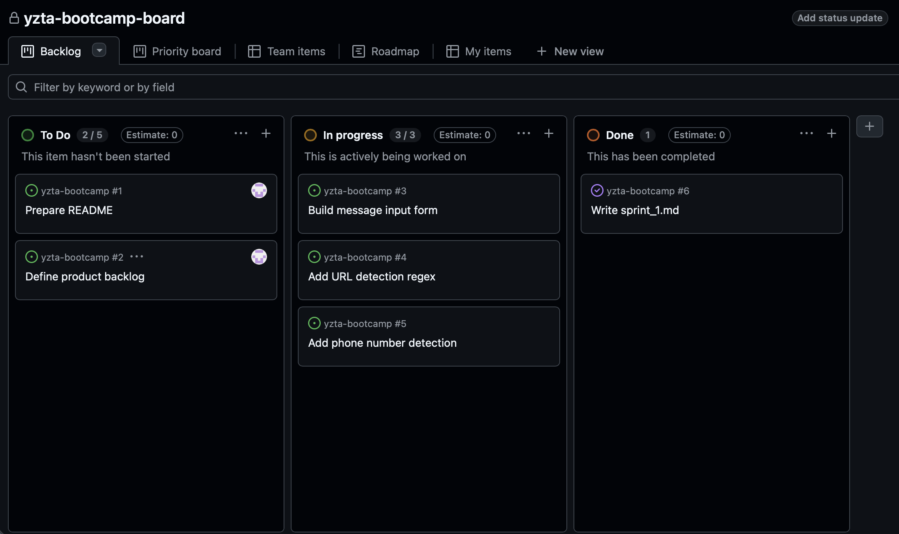
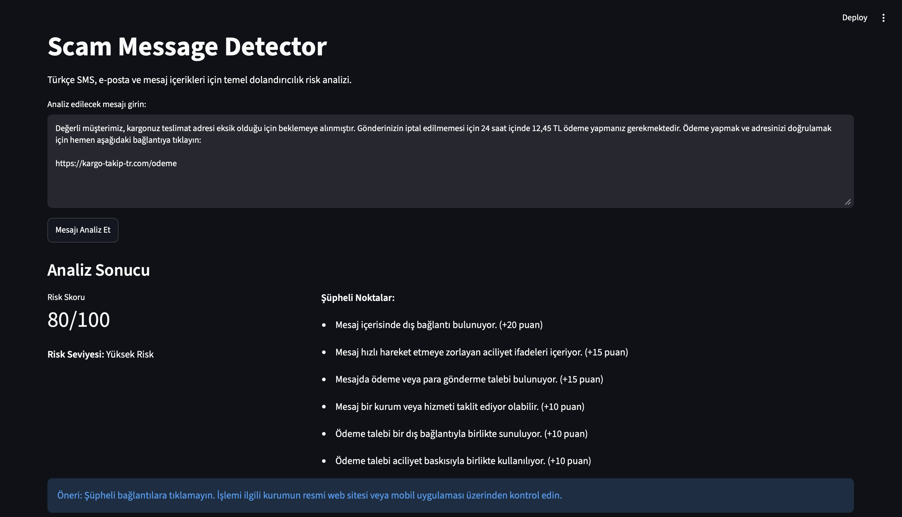
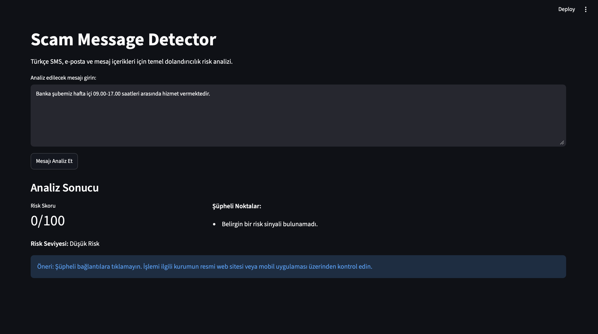
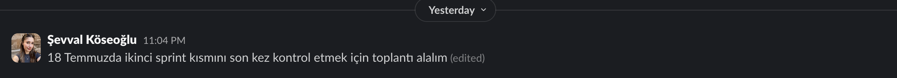
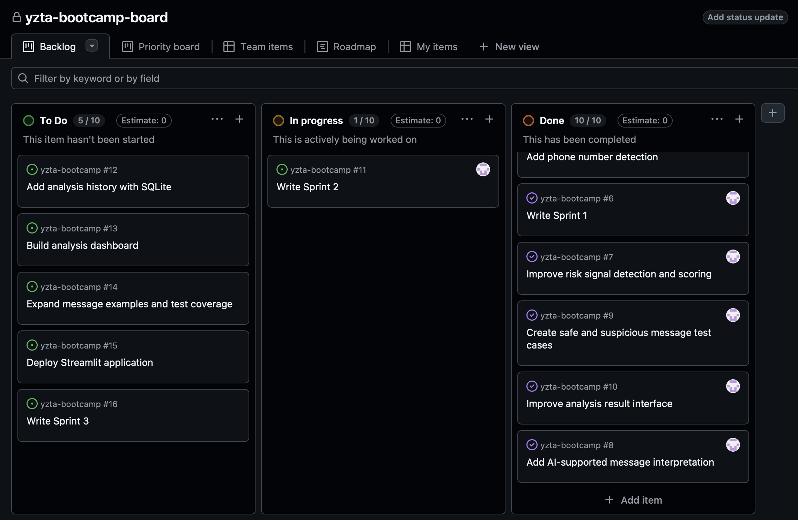
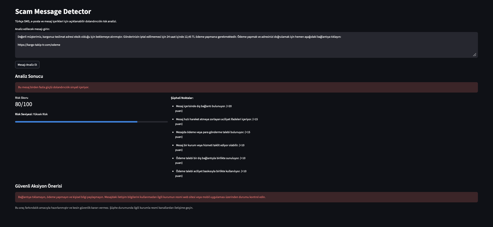
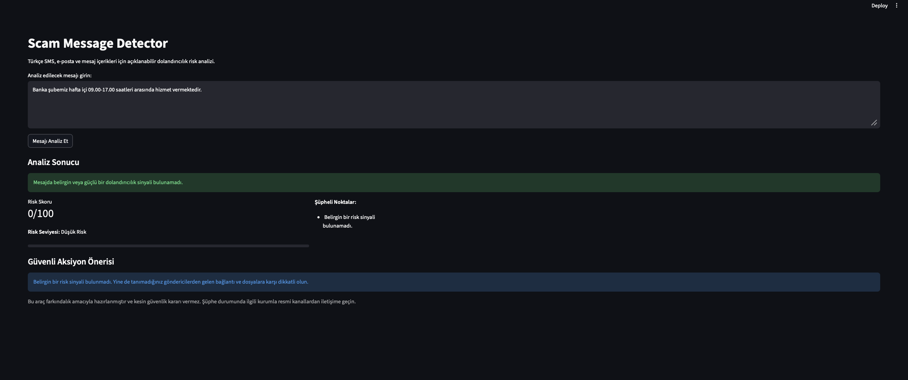
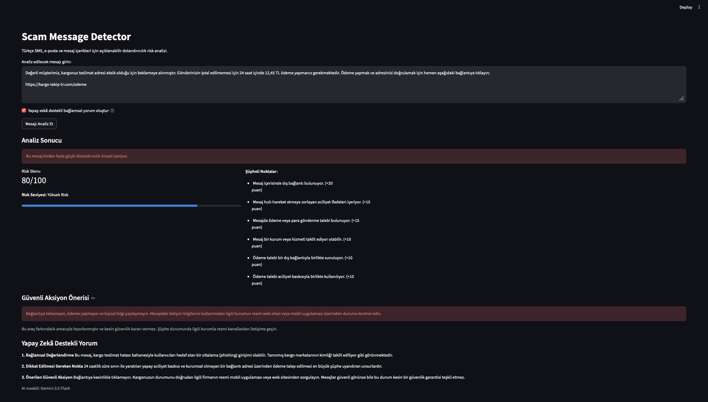
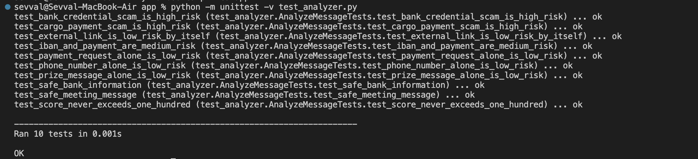

# YZTA Bootcamp 2026

## Takım İsmi

Grup 18

---

## Team Members

| Name            | Title         |
| --------------- | ------------- |
| Şevval Köseoğlu | Scrum Master  |
| Merve Altınsoy  | Product Owner |

---

## Ürün İsmi

**Scam Message Detector**

---

## Ürün Fikri

Scam Message Detector, Türkçe SMS, e-posta ve mesaj içeriklerini analiz ederek dolandırıcılık riskini puanlayan, şüpheli öğeleri açıklayan ve kullanıcıya güvenli aksiyon önerileri sunan yapay zekâ destekli bir güvenlik farkındalık asistanıdır.

---

## Ürün Açıklaması

Scam Message Detector, kullanıcıların şüpheli gördüğü mesajları analiz ederek dolandırıcılık riski hakkında anlaşılır bir değerlendirme sunmayı amaçlar.

Kullanıcı sisteme SMS, e-posta veya mesaj uygulamalarından aldığı şüpheli bir metni girer. Sistem mesaj içerisindeki link, telefon numarası, IBAN, ödeme talebi, aciliyet ifadesi, kurum taklidi ve benzeri risk sinyallerini analiz eder. Analiz sonucunda kullanıcıya bir risk skoru, şüpheli bulunan noktalar ve güvenli aksiyon önerileri sunulur.

Bu ürünün amacı kesin hukuki, finansal veya teknik güvenlik kararı vermek değildir. Amaç, kullanıcıların dijital dolandırıcılık girişimlerine karşı daha bilinçli hareket etmesine yardımcı olmaktır.

---

## Problem

Günümüzde kullanıcılar; sahte kargo mesajları, banka taklidi yapan SMS’ler, sahte çekiliş duyuruları, burs dolandırıcılıkları ve kimlik avı bağlantılarıyla sıkça karşılaşmaktadır. Bu mesajlar çoğu zaman kullanıcıyı acele karar vermeye zorlar ve linke tıklama, ödeme yapma veya kişisel bilgi paylaşma gibi riskli davranışlara yönlendirir.

Özellikle dijital güvenlik farkındalığı düşük kullanıcılar için bu mesajların güvenilir olup olmadığını anlamak zor olabilir. Scam Message Detector, bu problemi Türkçe mesajlar özelinde analiz ederek kullanıcıya anlaşılır bir risk değerlendirmesi sunmayı hedefler.

---

## Hedef Kitle

* SMS, e-posta ve mesaj uygulamalarını aktif kullanan bireyler
* Dolandırıcılık mesajlarını ayırt etmekte zorlanan kullanıcılar
* Yaşlı bireyler ve dijital güvenlik farkındalığı düşük kullanıcılar
* Banka, kargo, e-devlet, burs veya çekiliş temalı sahte mesajlara karşı korunmak isteyen kişiler
* Temel düzeyde siber güvenlik farkındalığı kazanmak isteyen kullanıcılar

---

## Ürün Özellikleri

Ürünün mevcut sürümünde yer alan temel özellikler:

* Kullanıcıdan Türkçe SMS, e-posta veya mesaj metni alma
* Link, telefon numarası ve IBAN formatlarını tespit etme
* Aciliyet, ödeme talebi ve kurum taklidi gibi risk sinyallerini analiz etme
* Kişisel bilgi, kart bilgisi, şifre ve doğrulama kodu taleplerini tespit etme
* Ödül, çekiliş, hesap kapatma, bloke ve yasal işlem ifadelerini analiz etme
* Tekil risk sinyallerini ve birlikte kullanılan sinyal kombinasyonlarını puanlama
* Mesaj için 0-100 arasında açıklanabilir risk skoru üretme
* Her şüpheli noktanın risk skoruna katkısını gösterme
* Risk seviyesine göre renkli sonuç bildirimi ve güvenli aksiyon önerisi sunma
* Gemini 3.5 Flash ile yapay zekâ destekli bağlamsal mesaj yorumu oluşturma
* Gemini servisine gönderilmeden önce telefon, IBAN ve uzun numaraları maskeleme
* Yapay zekâ servisine erişilemediğinde kural tabanlı analizle çalışmaya devam etme
* Güvenli ve şüpheli mesaj senaryolarını otomatik testlerle doğrulama

---

## Kullanılan Teknolojiler

| Teknoloji | Kullanım Amacı |
| --------- | -------------- |
| Python | Ana geliştirme dili |
| Streamlit | Web arayüzü |
| Regex | Link, telefon, IBAN ve anahtar kelime tespiti |
| Gemini 3.5 Flash | Yapay zekâ destekli bağlamsal mesaj yorumu |
| Google Gen AI SDK | Gemini API entegrasyonu |
| unittest | Otomatik analiz testleri |
| GitHub | Versiyon kontrolü ve proje dokümantasyonu |
| GitHub Projects / Issues | Sprint ve backlog takibi |

---

## Kurulum ve Çalıştırma

Repository bilgisayara indirildikten sonra uygulama klasörüne geçilir:

```bash
cd app
```

Gerekli Python kütüphaneleri yüklenir:

```bash
pip install -r requirements.txt
```

Yapay zekâ destekli bağlamsal analiz özelliğini kullanmak için Gemini API anahtarı ortam değişkeni olarak tanımlanır:

```bash
export GEMINI_API_KEY="YOUR_API_KEY"
```

API anahtarı doğrudan kod içerisinde tutulmamalı ve GitHub repository'sine yüklenmemelidir. API anahtarı tanımlanmadığında veya Gemini servisine erişilemediğinde uygulama kural tabanlı analiz sistemiyle çalışmaya devam eder.

Streamlit uygulaması aşağıdaki komutla başlatılır:

```bash
streamlit run main.py
```

Otomatik testler aşağıdaki komutla çalıştırılır:

```bash
python -m unittest -v test_analyzer.py
```

---

## Product Backlog

| No | User Story                                                                                                                        | Öncelik | Durum |
| -- | --------------------------------------------------------------------------------------------------------------------------------- | ------- | ----- |
| 1  | Kullanıcı olarak mesaj metni girmek istiyorum, böylece mesajın riskli olup olmadığını analiz edebilirim.                          | High    | To Do |
| 2  | Kullanıcı olarak mesajdaki şüpheli linkleri görmek istiyorum, böylece linke tıklamadan önce riskleri anlayabilirim.               | High    | To Do |
| 3  | Kullanıcı olarak mesaj için bir risk skoru görmek istiyorum, böylece mesajın ne kadar tehlikeli olabileceğini anlayabilirim.      | High    | To Do |
| 4  | Kullanıcı olarak mesajın neden riskli olduğunu madde madde görmek istiyorum, böylece sonucu daha kolay anlayabilirim.             | High    | To Do |
| 5  | Kullanıcı olarak güvenli aksiyon önerileri almak istiyorum, böylece şüpheli mesaj karşısında ne yapmam gerektiğini öğrenebilirim. | Medium  | To Do |
| 6  | Takım olarak sprint sürecini GitHub üzerinde belgelemek istiyoruz, böylece proje gelişimi düzenli şekilde takip edilebilir.       | High    | To Do |

---
<details>
<summary><h1>Sprint 1</h1></summary>

## Backlog Düzeni ve Story Seçimleri

Backlog'umuz Sprint 1 kapsamında öncelikli olarak yapılması gereken story'lere göre düzenlenmiştir. İlk sprintte amaç, ürünün temel yapısını kurmak ve kullanıcıdan alınan mesaj metni üzerinden basit bir risk analizi yapabilen ilk prototipi geliştirmektir.

Sprint başına tahmin edilen puan sayısını geçmeyecek şekilde story seçimleri yapılmıştır. Story başına çıkan tahmin puanı, toplam sprint puanının yarısından az tutulmuştur.

Sprint 1 için seçilen story'ler aşağıdaki gibidir:

| No | Story                                                                                                                             | Tahmin Puanı | Öncelik |
| -- | --------------------------------------------------------------------------------------------------------------------------------- | -----------: | ------- |
| 1  | Kullanıcı olarak mesaj metni girmek istiyorum, böylece mesajın riskli olup olmadığını analiz edebilirim.                          |            3 | High    |
| 2  | Kullanıcı olarak mesajdaki şüpheli linkleri görmek istiyorum, böylece linke tıklamadan önce riskleri anlayabilirim.               |            5 | High    |
| 3  | Kullanıcı olarak mesaj için bir risk skoru görmek istiyorum, böylece mesajın ne kadar tehlikeli olabileceğini anlayabilirim.      |            5 | High    |
| 4  | Kullanıcı olarak mesajın neden riskli olduğunu madde madde görmek istiyorum, böylece sonucu daha kolay anlayabilirim.             |            5 | High    |
| 5  | Kullanıcı olarak güvenli aksiyon önerileri almak istiyorum, böylece şüpheli mesaj karşısında ne yapmam gerektiğini öğrenebilirim. |            2 | Medium  |

Story'ler yapılacak işlere, yani task'lere bölünmüştür. Sprint 1 kapsamında belirlenen temel task'ler; repository yapısının oluşturulması, README dosyasının hazırlanması, Streamlit arayüzünün kurulması, mesaj giriş alanının oluşturulması, link/telefon/IBAN tespiti için regex yapısının hazırlanması ve temel risk skoru hesaplama fonksiyonunun geliştirilmesidir.

---

## Daily Scrum

Sprint 1 sürecinde ekip içi iletişim ağırlıklı olarak mesajlaşma kanalı üzerinden yürütülmüştür.

Bu süreçte repository paylaşımı, Scrum Master ve Product Owner rollerinin belirlenmesi, ürün fikrinin netleştirilmesi, toplantı planlaması ve ekip bilgileri formu için gerekli bilgilerin toplanması gibi konular konuşulmuştur.

Daily Scrum / ekip iletişimi ekran görüntüleri aşağıda paylaşılmıştır:



---

## Sprint Board Update

Sprint board üzerinde Sprint 1 için seçilen story'ler ve task'ler takip edilmiştir. Görevler To Do, In Progress ve Done durumlarına göre düzenlenmiştir.

Sprint board screenshotları:



---

## Ürün Durumu

Sprint 1 kapsamında ürünün tamamlanmış sürümü değil, ilk ürün prototipi ve arayüz taslağı hedeflenmiştir. Bu nedenle kullanıcıdan mesaj metni alan, temel risk sinyallerini kontrol etmeyi amaçlayan ve risk skorunu kullanıcıya gösterecek başlangıç ekranı hazırlanmıştır.

Sprint 1 ürün çıktısı kapsamında hedeflenen özellikler:

* Kullanıcıdan mesaj metni alma
* Link, telefon numarası ve IBAN formatı kontrolü
* Aciliyet ve ödeme talebi içeren ifadeleri analiz etme
* Temel risk skoru üretme
* Kullanıcıya şüpheli noktaları listeleme
* Güvenli aksiyon önerisi sunma

Ürün durumu ekran görüntüsü:




---

## Sprint Review

Sprint Review sırasında Sprint 1 kapsamında yapılan çalışmalar değerlendirilmiştir. Takım, ürün fikrini netleştirmiş ve ilk sprint için kapsamın temel risk analizi ile sınırlı tutulmasına karar vermiştir.

Alınan kararlar:

* Ürünün isminin Scam Message Detector olmasına karar verilmiştir.
* İlk sprintte kapsamın temel prototip ve risk analizi akışıyla sınırlı tutulmasına karar verilmiştir.
* Kullanıcıdan mesaj metni alınması, risk sinyallerinin tespit edilmesi ve risk skoru üretilmesi Sprint 1’in ana hedefi olarak belirlenmiştir.
* Gelişmiş yapay zekâ açıklamaları, analiz geçmişi ve dashboard özelliklerinin sonraki sprintlerde ele alınmasına karar verilmiştir.
* Verilerin kalıcı olarak saklanması için JSON veya SQLite kullanımının sonraki sprintte değerlendirilmesine karar verilmiştir.
* Çıkan ürünün ilk prototip akışında temel analiz mantığı için bir problem görülmemiştir.
* Ekstra eklenmesi gereken özellikler sonraki sprint için backlog'a aktarılmıştır.

Sprint Review katılımcıları:

* Şevval Köseoğlu

---

## Sprint Retrospective

Sprint Retrospective sırasında takımın Sprint 1 sürecindeki çalışma düzeni değerlendirilmiş ve sonraki sprint için iyileştirme alanları belirlenmiştir.

Alınan kararlar:

* Takım içindeki görev dağılımıyla ilgili düzenleme yapılması kararı alınmıştır.
* Tahmin puanları gözden geçirilmeli ve sprint planlama toplantılarında gerekli geri bildirimlerin developer tarafından verildiğine emin olunmalıdır.
* Daily Scrum ekran görüntülerinin daha düzenli şekilde saklanmasına karar verilmiştir.
* Sprint board güncellemelerinin daha sık yapılması gerektiği belirlenmiştir.
* Test mesajları için ayrılan eforun artırılmasına karar verilmiştir.
* Risk skoru hesaplama sisteminin sonraki sprintte daha detaylı hale getirilmesi planlanmıştır.
</details>

---

<details>
<summary><h1>Sprint 2</h1></summary>

## Backlog Düzeni ve Story Seçimleri

Backlog'umuz Sprint 2 kapsamında, Sprint 1 sonunda elde edilen çalışan prototipin geliştirilmesine yönelik öncelikli story'lere göre düzenlenmiştir. İkinci sprintte amaç; mevcut risk analizi sistemini daha detaylı hale getirmek, farklı mesaj örnekleriyle test etmek ve mesajın bağlamını değerlendirebilen yapay zekâ destekli analiz özelliğini ürüne eklemektir.

Sprint başına tahmin edilen puan sayısını geçmeyecek şekilde story seçimleri yapılmıştır. Story başına çıkan tahmin puanı, toplam sprint puanının yarısından az tutulmuştur. Sprint 2 kapsamında toplam 18 puanlık iş tamamlanması hedeflenmiştir.

Sprint 2 için seçilen story'ler aşağıdaki gibidir:

| No | Story | Tahmin Puanı | Öncelik |
| -- | ----- | -----------: | ------- |
| 7 | Kullanıcı olarak daha detaylı bir risk analizi görmek istiyorum, böylece mesajdaki farklı dolandırıcılık sinyallerini anlayabilirim. | 5 | High |
| 8 | Kullanıcı olarak mesajın bağlamını değerlendiren yapay zekâ destekli bir yorum görmek istiyorum, böylece yalnızca anahtar kelimelere dayanmayan bir sonuç alabilirim. | 8 | High |
| 9 | Kullanıcı olarak sistemin farklı güvenli ve şüpheli mesajlarla test edilmesini istiyorum, böylece analiz sonuçlarının güvenilirliğini değerlendirebilirim. | 3 | High |
| 10 | Kullanıcı olarak analiz sonucunu daha anlaşılır bir arayüzde görmek istiyorum, böylece risk seviyesini ve şüpheli noktaları kolayca inceleyebilirim. | 2 | Medium |

Story'ler yapılacak işlere, yani task'lere bölünmüştür. Sprint 2 kapsamında belirlenen temel task'ler; yeni dolandırıcılık sinyallerinin eklenmesi, risk skoru ağırlıklarının yeniden düzenlenmesi, kişisel bilgi talebi ile ödül ve hesap kapatma tehdidi içeren ifadelerin tespit edilmesi, yapay zekâ destekli bağlamsal mesaj analizinin eklenmesi, yapay zekâ servisine erişilemediğinde kural tabanlı sistemin çalışmaya devam etmesinin sağlanması, güvenli ve şüpheli test mesajlarının hazırlanması ve Streamlit sonuç ekranının geliştirilmesidir.

---

## Daily Scrum

Sprint 2 başlangıcında backlog'un değerlendirilmesi, görevlerin planlanması ve geliştirme sürecinin belirlenmesi amacıyla ekip içi iletişim mesajlaşma kanalı üzerinden yürütülmüştür.

Daily Scrum / ekip iletişimi ekran görüntüleri aşağıda paylaşılmıştır:



---

## Sprint Board Update

Sprint board üzerinde Sprint 2 için seçilen story'ler ve bu story'lere bağlı task'ler takip edilmiştir. Sprint 2 kapsamında planlanan geliştirme, test, arayüz ve yapay zekâ entegrasyonu görevleri tamamlanarak Done durumuna taşınmıştır.

Sprint Review sonucunda analiz geçmişi, dashboard, test kapsamının genişletilmesi ve uygulamanın canlıya alınması çalışmaları Sprint 3 backlog'una eklenmiş ve To Do durumunda bırakılmıştır.

Sprint board screenshotları:



---

## Ürün Durumu

Sprint 2 kapsamında, Sprint 1’de oluşturulan kural tabanlı prototipin risk analizi, test edilebilirlik, kullanıcı deneyimi ve yapay zekâ desteği bakımından geliştirilmesi hedeflenmiştir.

Risk analizi mantığı arayüz kodundan ayrılarak daha düzenli ve test edilebilir bir yapı oluşturulmuştur. Tekil risk sinyallerinin yanında, bağlantı ile ödeme talebi veya aciliyet ile ödeme talebi gibi birlikte kullanıldığında dolandırıcılık ihtimalini artıran sinyal kombinasyonları da puanlamaya dahil edilmiştir.

Sprint 2 ürün çıktısı kapsamında tamamlanan özellikler:

* Risk sinyallerinin ağırlıklarının yeniden düzenlenmesi
* Kişisel bilgi, kart bilgisi, şifre ve doğrulama kodu taleplerinin tespit edilmesi
* Ödül, çekiliş ve hediye vaatlerinin analiz edilmesi
* Hesap kapatma, bloke ve yasal işlem tehditlerinin tespit edilmesi
* Birlikte kullanılan risk sinyalleri için ek puan hesaplanması
* Her şüpheli noktanın risk skoruna katkısının gösterilmesi
* Güvenli ve şüpheli mesajlar için otomatik testlerin hazırlanması
* Risk seviyesine göre renkli sonuç bildirimi gösterilmesi
* Risk skorunun ilerleme çubuğu ile görselleştirilmesi
* Risk seviyesine göre güvenli aksiyon önerisi sunulması
* Gemini 3.5 Flash ile yapay zekâ destekli bağlamsal mesaj yorumu üretilmesi
* Gemini servisine gönderilmeden önce telefon, IBAN ve uzun numaraların maskelenmesi
* Yapay zekâ servisine erişilemediğinde kural tabanlı analizin çalışmaya devam etmesi

Hazırlanan 10 otomatik test başarıyla tamamlanmıştır. Güvenli banka bilgilendirme mesajı 0/100 düşük risk, sahte kargo ve ödeme mesajı ise 80/100 yüksek risk olarak değerlendirilmiştir.

Ürün durumu ve test ekran görüntüleri:






---

## Sprint Review

Sprint Review sırasında Sprint 2 kapsamında gerçekleştirilen geliştirme, test ve yapay zekâ entegrasyonu çalışmaları değerlendirilmiştir. Sprint için planlanan toplam 18 puanlık çalışma tamamlanmıştır.

Alınan kararlar:

* Kural tabanlı risk analizi sisteminin geliştirilerek kullanılmaya devam edilmesine karar verilmiştir.
* Risk sinyallerinin tek başına değerlendirilmesinin yanı sıra, bağlantı ve ödeme talebi gibi birlikte kullanılan sinyallerin de puanlamaya dahil edilmesine karar verilmiştir.
* Risk analizi mantığının Streamlit arayüzünden ayrılmasıyla kodun daha düzenli ve test edilebilir olması sağlanmıştır.
* Güvenli ve şüpheli mesajlardan oluşan 10 otomatik test başarıyla tamamlanmıştır.
* Kullanıcının sonucu daha kolay yorumlayabilmesi için risk seviyesine göre renkli bildirimler ve güvenli aksiyon önerileri eklenmiştir.
* Gemini 3.5 Flash modeli kullanılarak yapay zekâ destekli bağlamsal mesaj yorumlama özelliği ürüne eklenmiştir.
* Telefon numarası, IBAN ve uzun numaraların Gemini servisine gönderilmeden önce maskelenmesine karar verilmiştir.
* Yapay zekâ servisine ulaşılamadığı durumlarda uygulamanın kural tabanlı analizle çalışmaya devam etmesi sağlanmıştır.
* Analiz geçmişi, dashboard ve kalıcı veri saklama özelliklerinin Sprint 3 kapsamında değerlendirilmesine karar verilmiştir.

Sprint Review katılımcısı:

* Şevval Köseoğlu

---

## Sprint Retrospective

Sprint Retrospective sırasında Sprint 2 sürecindeki çalışma düzeni, teknik geliştirmeler ve proje yönetimi değerlendirilmiştir.

Alınan kararlar:

* Büyük geliştirme işlerinin daha küçük ve test edilebilir parçalara ayrılmasının çalışma sürecini kolaylaştırdığı görülmüştür.
* Risk analizi mantığının ayrı bir dosyada tutulmasının kodun okunabilirliğini ve test edilebilirliğini artırdığı belirlenmiştir.
* Otomatik testlerin hataları erken fark etmek ve güvenli mesajlardaki yanlış pozitif sonuçları azaltmak açısından faydalı olduğu görülmüştür.
* Sprint board'un geliştirme süreci boyunca daha sık güncellenmesi gerektiği değerlendirilmiştir.
* API anahtarı gibi hassas bilgilerin kod içerisinde veya GitHub repository'sinde tutulmamasına dikkat edilmesine karar verilmiştir.
* Sprint 3 kapsamında analiz geçmişi, dashboard, daha geniş test verisi ve uygulamanın canlıya alınması çalışmalarına öncelik verilmesi planlanmıştır.
</details>